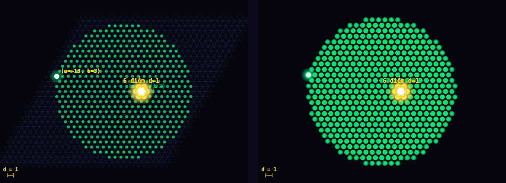

# Erdős Unit Distance Problem — Interactive Simulation

> **[English](#english) | [Tiếng Việt](#tiếng-việt)**

---

<a name="english"></a>
# English

An interactive visualization of the classic **Erdős Unit Distance Problem** and the breakthrough 2025 OpenAI result proving that the number of unit-distance pairs can grow super-linearly.


*CM Eisenstein Q(√−3) lattice — 500 points, 1,420 unit-distance pairs. Selected point (white/gold) highlights its 6 exact unit-distance neighbors.*

**→ Open `erdos_unit_distance_web.html` directly in any modern browser. No installation required.**

---

## The Erdős Unit Distance Problem

> *Given n points in the plane, what is the maximum number of pairs at distance exactly 1?*
>
> — Paul Erdős, 1946

Let **ν(n)** denote this maximum. The key results over the decades:

| Result | Formula | Authors |
|--------|---------|---------|
| Lower bound (square grid) | ν(n) ≥ 2n − O(√n) | Erdős 1946 |
| Lower bound (hexagonal lattice) | ν(n) ≥ 3n − O(√n) | Erdős 1946 |
| **New lower bound** | **ν(n) ≥ n^{1+δ} for some δ > 0** | **OpenAI 2025** |
| Upper bound (Spencer–Tardos–Trotter) | ν(n) = O(n^{4/3}) | Spencer et al. 1984 |

In 2025, OpenAI **disproved Erdős's linear conjecture**: there exists a fixed δ > 0 such that for infinitely many n, ν(n) ≥ n^{1+δ}.

---

## Three Construction Methods

### 1. Square Grid (Z²)

Points at integer coordinates **(i, j) ∈ Z²**. Two points are at unit distance when their coordinate differences are (±1, 0) or (0, ±1).

**Exact formula:**
```
ν(n) = 2n − k − m,   where k = ⌈√n⌉, m = ⌈n/k⌉
```

**Unit-distance neighbors per point:** 4

**Analytical exponent α:**
```
α(n) = (2√n − 1) / (2(√n − 1))  →  1  as n → ∞
```

---

### 2. CM Eisenstein Q(√−3) — Hexagonal Lattice

Points at **Eisenstein integers** Z[ω], where ω = e^{2πi/3} = −½ + i√3/2.

A point z = a + bω has Cartesian coordinates:
```
x = a + b/2,    y = b·√3/2
```

Norm: |z|² = a² + ab + b². The origin has exactly **6 unit-distance neighbors** (norm 1 has 6 solutions).

**Asymptotic formula:**
```
ν(n) ≈ 3n − B·√n,   B ≈ 3√(2π/√3) ≈ 4.948
```

**Analytical exponent α:**
```
α(n) = (6√n − B) / (2(3√n − B))  →  1  as n → ∞
```

**Why Eisenstein?** The prime 7 ≡ 1 (mod 3) **splits** in Z[ω], enabling the construction of infinite class field towers with bounded root discriminant.

---

### 3. OpenAI CM Multi-layer — Class Field Tower

The core construction of the OpenAI 2025 result, visualized here with **3 conceptual layers**:

```
Layer 1 (green):   Z[ω] × 1       — base Eisenstein lattice
Layer 2 (orange):  Z[ω] × 1/√7   — scaled by 1/√7
Layer 3 (purple):  Z[ω] × 1/7    — scaled by 1/7
```

**Unit-distance neighbors per layer** (Eisenstein integer representation theory):

| Layer | Required norm | Solutions | Neighbors/point |
|-------|--------------|-----------|-----------------|
| Layer 1 | 1  | 6·(0+1) = 6  | 6  |
| Layer 2 | 7  | 6·(1+1) = 12 | 12 |
| Layer 3 | 49 | 6·(2+1) = 18 | 18 |

General formula: norm 7^j has **6(j+1)** Eisenstein representations.

**The actual tower in the OpenAI paper:**

Golod–Shafarevich theory guarantees an **infinite tower**:
```
F = F₀ ⊂ F₁ ⊂ F₂ ⊂ F₃ ⊂ ...
```
Each Fⱼ is totally real, [Fⱼ:Q] → ∞, but the root discriminant rd(Fⱼ) = rd(F₀) stays bounded. The CM fields Kⱼ = Fⱼ(i) generate point sets with increasingly many unit pairs.

The 3-layer simulation is a **conceptual illustration** — the actual proof uses j → ∞.

---

## Features

### Canvas Controls

| Canvas | Action | Effect |
|--------|--------|--------|
| Algebraic space (OpenAI) | Left drag | 3D rotation (azimuth + elevation) |
| Algebraic space (all) | Right drag / Shift+drag | Pan X/Y |
| Algebraic space | Scroll | Zoom in/out |
| Algebraic space | Double-click | Reset view |
| 2D projection | Drag | Pan |
| 2D projection | Scroll | Zoom (centered on cursor) |
| 2D projection | Double-click | Reset zoom/pan |
| Both canvases | Click on a point | Select — highlight unit-distance neighbors |
| Both canvases | Click on empty area | Deselect |

### Point Selection — Highlight Unit Neighbors

Click any point to:
- **Selected point**: white glow + gold ring
- **Neighbors at d=1**: bright gold highlight
- **Dashed lines**: connecting selected point to each neighbor
- **Label**: "N điểm d=1" shown above the point
- Both canvases stay in sync

### Reference Circle / Sphere ⊙ d=1

Toggle with the **⊙ d=1** button:
- Move cursor over canvas → dashed circle of radius 1 appears at cursor position
- 2D views: **circle** with "d=1" label
- OpenAI 3D: **sphere silhouette** (circle + equatorial ellipse for depth cue)
- **Scale bar** in the bottom-left corner always shows current d=1 length in screen pixels

### Log-Log Chart

Compares empirical ν(n) against theoretical curves:
- Erdős asymptotic: n^{1 + c / ln ln n}
- OpenAI estimate: n^{1.014}
- Spencer–Tardos–Trotter upper bound: n^{4/3}

### Real-Time Statistics

| Metric | Description |
|--------|-------------|
| n | Current point count |
| ν(n) | Unit-distance pair count |
| α OLS | Power-law exponent via OLS regression on last 40 log-log points |
| α analytical | Exact formula exponent for the current method |
| ν̂ method | ν predicted by the method's exact/asymptotic formula at current n |
| S-T upper bound | Spencer-Tardos-Trotter: O(n^{4/3}) |

---

## Getting Started

```bash
git clone https://github.com/quanglehuy2911/Erdos-Unit-Distance-Simulation.git
cd Erdos-Unit-Distance-Simulation

# Open directly (no server needed)
open erdos_unit_distance_web.html

# Or run a local server (recommended to avoid CORS)
python3 -m http.server 3500
# → http://localhost:3500/erdos_unit_distance_web.html
```

**Requirements:** Chrome / Firefox / Safari (modern version). No Node.js, no backend.

---

## Technical Details

### Pair Detection

```javascript
// O(n) per new point added — O(n²) overall
function findNewPairs(points, newIdx) {
  const p = points[newIdx];
  const newPairs = [];
  for (let i = 0; i < newIdx; i++) {
    const dx = p.x - points[i].x, dy = p.y - points[i].y;
    if (Math.abs(dx*dx + dy*dy - 1.0) < EPS) newPairs.push({ i, j: newIdx });
  }
  return newPairs;
}
```

### Canvas Transform

```
ctx.translate(W/2 + panX, H/2 + panY)
ctx.scale(zoom, zoom)
ctx.translate(-W/2, -H/2)

// Virtual canvas coords → screen pixels:
screen_x = (vx - W/2) × zoom + W/2 + panX
```

### OLS α Estimation

Linear regression on log(n) vs log(ν(n)) over last 40 history points:
```
α = [n·Σ(ln n · ln ν) − Σln n · Σln ν] / [n·Σ(ln n)² − (Σln n)²]
```

---

## The OpenAI 2025 Result

Paper: *"A counterexample to the unit-distance conjecture"* (2025)

**Main theorem:** There exists a constant δ > 0 such that for infinitely many n:
```
ν(n) ≥ n^{1+δ}
```

**Proof sketch:**
1. Choose a cyclic cubic field F₀ whose class group has an element of 3-power order
2. Golod–Shafarevich → infinite unramified pro-3 tower: F₀ ⊂ F₁ ⊂ F₂ ⊂ ...
3. Each Fⱼ is totally real, [Fⱼ:Q] → ∞, root discriminant rd(Fⱼ) = rd(F₀) is bounded
4. CM fields Kⱼ = Fⱼ(i): all elements have modulus 1 under every complex embedding
5. Ring of integers of Kⱼ gives a point set with many unit-distance pairs
6. Combining infinitely many layers yields ν(n) ≥ n^{1+δ}

A companion paper by Alon, Bloom, Gowers et al. simplifies and makes the proof fully rigorous.

> **Note on the simulation:** The "n^{1.014}" label is an empirical estimate from 3 demonstration layers. The actual paper only proves **existence** of some δ > 0 — the precise value is not determined.

---

## References

1. **Erdős, P.** (1946). *On sets of distances of n points.* American Mathematical Monthly, 53(5), 248–250.
2. **Spencer, J., Szemerédi, E., & Trotter, W.T.** (1984). *Unit distances in the Euclidean plane.* Graph Theory and Combinatorics, 293–308.
3. **OpenAI** (2025). *A counterexample to the unit-distance conjecture.*
4. **Alon, N., Bloom, T., Gowers, W.T., et al.** (2025). *On the unit distance problem.* (Companion paper)
5. **Golod, E.S. & Shafarevich, I.R.** (1964). *On the class field tower.* Izvestiya Akademii Nauk SSSR, 28.

---
---

<a name="tiếng-việt"></a>
# Tiếng Việt

Mô phỏng tương tác trực quan bài toán **Erdős Unit Distance** cổ điển và kết quả đột phá của OpenAI (2025) chứng minh rằng số cặp điểm cách nhau đúng 1 đơn vị có thể vượt tuyến tính.


*Lưới Eisenstein Q(√−3) — 500 điểm, 1.420 cặp khoảng cách 1. Điểm được chọn (trắng/vàng) highlight đúng 6 hàng xóm cách nó 1 đơn vị.*

**→ Mở file `erdos_unit_distance_web.html` trực tiếp trong trình duyệt. Không cần cài đặt gì thêm.**

---

## Bài toán Erdős Unit Distance

> *Cho n điểm bất kỳ trong mặt phẳng, tối đa có bao nhiêu cặp điểm cách nhau đúng 1 đơn vị?*
>
> — Paul Erdős, 1946

Gọi **ν(n)** là số cặp unit-distance tối đa. Các kết quả quan trọng theo thời gian:

| Kết quả | Công thức | Tác giả |
|---------|-----------|---------|
| Cận dưới (lưới vuông) | ν(n) ≥ 2n − O(√n) | Erdős 1946 |
| Cận dưới (lưới Eisenstein) | ν(n) ≥ 3n − O(√n) | Erdős 1946 |
| **Cận dưới mới** | **ν(n) ≥ n^{1+δ} với δ > 0** | **OpenAI 2025** |
| Cận trên (Spencer–Tardos–Trotter) | ν(n) = O(n^{4/3}) | Spencer et al. 1984 |

Năm 2025, OpenAI công bố kết quả **bác bỏ giả thuyết tuyến tính của Erdős**: tồn tại hằng số δ > 0 sao cho với vô hạn nhiều n, ν(n) ≥ n^{1+δ}.

---

## Ba phương pháp mô phỏng

### 1. Lưới Vuông (Square Grid)

Điểm đặt tại tọa độ nguyên **(i, j) ∈ Z²**. Hai điểm cách nhau đúng 1 khi chênh lệch tọa độ là (±1, 0) hoặc (0, ±1).

**Công thức chính xác:**
```
ν(n) = 2n − k − m,   k = ⌈√n⌉, m = ⌈n/k⌉
```

**Số hàng xóm unit-distance mỗi điểm:** 4

**Exponent α (giải tích):**
```
α(n) = (2√n − 1) / (2(√n − 1))  →  1  khi n → ∞
```

---

### 2. CM Eisenstein Q(√−3) — Lưới Lục Giác

Điểm đặt tại các **số nguyên Eisenstein** Z[ω] với ω = e^{2πi/3} = −½ + i√3/2.

Mỗi điểm z = a + bω tương ứng tọa độ Descartes:
```
x = a + b/2,    y = b·√3/2
```

Norm: |z|² = a² + ab + b². Mỗi điểm có đúng **6 hàng xóm** cách nó 1 đơn vị.

**Công thức tiệm cận:**
```
ν(n) ≈ 3n − B·√n,   B ≈ 3√(2π/√3) ≈ 4.948
```

**Exponent α (giải tích):**
```
α(n) = (6√n − B) / (2(3√n − B))  →  1  khi n → ∞
```

**Tại sao chọn Eisenstein?** Số nguyên tố 7 ≡ 1 (mod 3) nên 7 **phân rã** trong Z[ω], cho phép xây dựng tháp trường số vô hạn với discriminant gốc bị chặn.

---

### 3. OpenAI CM Multi-layer — Tháp Class Field

Phương pháp cốt lõi của kết quả OpenAI 2025, được mô phỏng với **3 tầng khái niệm**:

```
Tầng 1 (xanh lá):  Z[ω] × 1       — lưới Eisenstein gốc
Tầng 2 (cam):      Z[ω] × 1/√7    — thu nhỏ √7 lần
Tầng 3 (tím):      Z[ω] × 1/7     — thu nhỏ 7 lần
```

**Số hàng xóm unit-distance mỗi tầng:**

| Tầng | Norm cần | Số nghiệm | Hàng xóm/điểm |
|------|----------|-----------|----------------|
| Tầng 1 | 1  | 6·(0+1) = 6  | 6  |
| Tầng 2 | 7  | 6·(1+1) = 12 | 12 |
| Tầng 3 | 49 | 6·(2+1) = 18 | 18 |

Công thức tổng quát: norm 7^j có **6(j+1)** biểu diễn Eisenstein.

**Tháp thực tế trong bài báo OpenAI:**

Lý thuyết Golod–Shafarevich đảm bảo tồn tại **tháp vô hạn**:
```
F = F₀ ⊂ F₁ ⊂ F₂ ⊂ F₃ ⊂ ...
```
Mỗi Fⱼ là trường số toàn thực, [Fⱼ:Q] → ∞, nhưng discriminant gốc rd(Fⱼ) = rd(F₀) bị chặn. CM fields Kⱼ = Fⱼ(i) tạo ra các tập điểm ngày càng nhiều cặp unit-distance hơn.

Mô phỏng 3 tầng là **minh họa khái niệm** — bài báo thực tế dùng j → ∞.

---

## Tính năng

### Điều khiển Canvas

| Canvas | Hành động | Kết quả |
|--------|-----------|---------|
| Không gian đại số (OpenAI) | Kéo trái | Xoay 3D (azimuth + elevation) |
| Không gian đại số (tất cả) | Kéo phải / Shift+kéo | Pan X/Y |
| Không gian đại số | Cuộn chuột | Zoom in/out |
| Không gian đại số | Double-click | Reset về góc nhìn mặc định |
| Mặt phẳng 2D | Kéo | Pan |
| Mặt phẳng 2D | Cuộn chuột | Zoom (căn giữa vào con trỏ) |
| Mặt phẳng 2D | Double-click | Reset zoom/pan |
| Cả hai canvas | Click điểm | Chọn → highlight hàng xóm d=1 |
| Cả hai canvas | Click vùng trống | Bỏ chọn |

### Click chọn điểm — Highlight hàng xóm d=1

Khi click vào một điểm:
- **Điểm chọn**: glow trắng + vòng vàng, to hơn
- **Điểm hàng xóm** (khoảng cách = 1): sáng vàng rực
- **Đường nét đứt**: nối điểm chọn đến từng hàng xóm
- **Nhãn**: "N điểm d=1" hiển thị ngay trên điểm
- Cả hai canvas đồng bộ cùng selection

### Vòng tròn / Cầu tham chiếu ⊙ d=1

Bật/tắt bằng button **⊙ d=1**:
- Di chuột vào canvas → vòng tròn nét đứt bán kính 1 xuất hiện tại con trỏ
- Mặt phẳng 2D và không gian Eisenstein: **hình tròn** + nhãn "d=1"
- Không gian 3D OpenAI: **hình cầu** (silhouette + ellipse xích đạo gợi ý chiều sâu)
- **Scale bar** góc dưới trái: hiển thị độ dài d=1 ở mức zoom hiện tại

### Biểu đồ Log-Log

So sánh ν(n) thực nghiệm với các đường lý thuyết:
- Erdős asymptotic n^{1+c/ln ln n}
- OpenAI ước lượng n^{1.014}
- Spencer–Tardos–Trotter bound n^{4/3}

### Thống kê thời gian thực

| Chỉ số | Mô tả |
|--------|-------|
| n | Số điểm hiện tại |
| ν(n) | Số cặp unit-distance |
| α OLS | Exponent lũy thừa từ hồi quy OLS trên 40 điểm log-log gần nhất |
| α giải tích | Exponent theo công thức chính xác của phương pháp |
| ν̂ phương pháp | Giá trị ν tính theo công thức lý thuyết tại n hiện tại |
| Cận trên S-T | Spencer-Tardos-Trotter: O(n^{4/3}) |

---

## Cài đặt và chạy

```bash
git clone https://github.com/quanglehuy2911/Erdos-Unit-Distance-Simulation.git
cd Erdos-Unit-Distance-Simulation

# Mở trực tiếp (không cần server)
open erdos_unit_distance_web.html

# Hoặc chạy local server (khuyến nghị)
python3 -m http.server 3500
# → http://localhost:3500/erdos_unit_distance_web.html
```

**Yêu cầu:** Chrome / Firefox / Safari phiên bản mới nhất. Không cần Node.js hay backend.

---

## Chi tiết kỹ thuật

### Phát hiện cặp unit-distance

```javascript
// O(n) mỗi khi thêm điểm mới — O(n²) tổng thể
function findNewPairs(points, newIdx) {
  const p = points[newIdx];
  const newPairs = [];
  for (let i = 0; i < newIdx; i++) {
    const dx = p.x - points[i].x, dy = p.y - points[i].y;
    if (Math.abs(dx*dx + dy*dy - 1.0) < EPS) newPairs.push({ i, j: newIdx });
  }
  return newPairs;
}
```

### Hệ tọa độ và transform

```
// Pan + zoom transform:
ctx.translate(W/2 + panX, H/2 + panY)
ctx.scale(zoom, zoom)
ctx.translate(-W/2, -H/2)

// Chuyển virtual canvas → screen pixel:
screen_x = (vx − W/2) × zoom + W/2 + panX

// Chiếu 3D (OpenAI — orthographic):
rx  = wx·cos(az) − wy·sin(az)
ryh = wx·sin(az) + wy·cos(az)
ry  = ryh·cos(el) − wz·sin(el)
screen = [cx + rx×zoom, cy − ry×zoom]
```

### Tính α bằng OLS

Hồi quy tuyến tính trên log(n) và log(ν(n)) với 40 điểm gần nhất:
```
α = [n·Σ(ln n · ln ν) − Σln n · Σln ν] / [n·Σ(ln n)² − (Σln n)²]
```

---

## Kết quả OpenAI 2025

Bài báo: *"A counterexample to the unit-distance conjecture"* (2025)

**Định lý chính:** Tồn tại hằng số δ > 0 sao cho với vô hạn nhiều n:
```
ν(n) ≥ n^{1+δ}
```

**Ý nghĩa:** Bác bỏ giả thuyết của Erdős rằng ν(n) = O(n^{1+o(1)}).

**Phác thảo chứng minh:**
1. Chọn trường cyclic cubic F₀ có class group chứa phần tử bậc lũy thừa 3
2. Golod–Shafarevich → tháp vô hạn unramified pro-3: F₀ ⊂ F₁ ⊂ F₂ ⊂ ...
3. Mỗi Fⱼ là totally real, [Fⱼ:Q] → ∞, rd(Fⱼ) = rd(F₀) bị chặn
4. CM fields Kⱼ = Fⱼ(i): mọi phần tử có modulus = 1 dưới mọi complex embedding
5. Ring of integers của Kⱼ tạo tập điểm với nhiều cặp unit-distance
6. Kết hợp vô hạn tầng → ν(n) ≥ n^{1+δ}

Companion paper của Alon, Bloom, Gowers và cộng sự đơn giản hóa và làm nghiêm ngặt chứng minh.

> **Lưu ý về mô phỏng:** Giá trị "n^{1.014}" là ước lượng thực nghiệm từ 3 tầng minh họa. Bài báo chỉ chứng minh **tồn tại** δ > 0, không xác định giá trị cụ thể.

---

## Tài liệu tham khảo

1. **Erdős, P.** (1946). *On sets of distances of n points.* American Mathematical Monthly, 53(5), 248–250.
2. **Spencer, J., Szemerédi, E., & Trotter, W.T.** (1984). *Unit distances in the Euclidean plane.* Graph Theory and Combinatorics, 293–308.
3. **OpenAI** (2025). *A counterexample to the unit-distance conjecture.*
4. **Alon, N., Bloom, T., Gowers, W.T., et al.** (2025). *On the unit distance problem.* (Companion paper)
5. **Golod, E.S. & Shafarevich, I.R.** (1964). *On the class field tower.* Izvestiya Akademii Nauk SSSR, 28.

---

## License

MIT License — free to use, modify, and share.
