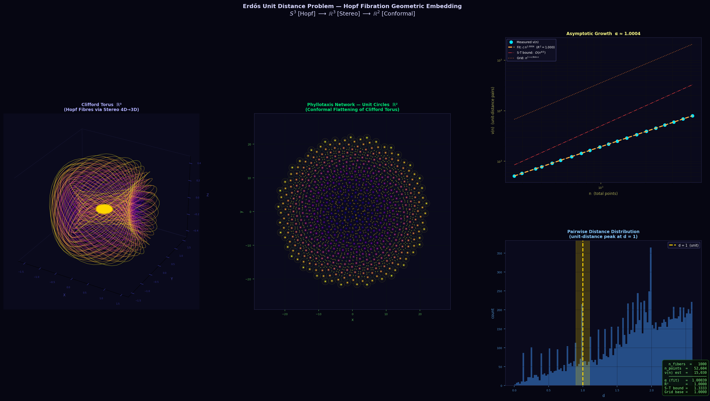

# Erdős Unit Distance Problem — Interactive Simulation

Mô phỏng tương tác trực quan bài toán **Erdős Unit Distance** cổ điển và kết quả đột phá của OpenAI (2025) chứng minh rằng số cặp điểm cách nhau đúng 1 đơn vị có thể vượt tuyến tính.



**[→ Mở file `erdos_unit_distance_web.html` trực tiếp trên trình duyệt để chạy]**

---

## Bài toán Erdős Unit Distance

> *Cho n điểm bất kỳ trong mặt phẳng, tối đa có bao nhiêu cặp điểm cách nhau đúng 1 đơn vị?*
>
> — Paul Erdős, 1946

Gọi **ν(n)** là số cặp unit-distance tối đa. Erdős đặt ra câu hỏi về tốc độ tăng của ν(n):

| Kết quả | Công thức | Tác giả |
|---------|-----------|---------|
| Cận dưới (lưới vuông) | ν(n) ≥ 2n − O(√n) | Erdős 1946 |
| Cận dưới (lưới Eisenstein) | ν(n) ≥ 3n − O(√n) | Erdős 1946 |
| **Cận dưới mới** | **ν(n) ≥ n^{1+δ} cho δ > 0** | **OpenAI 2025** |
| Cận trên (Spencer–Tardos–Trotter) | ν(n) = O(n^{4/3}) | Spencer et al. 1984 |

Năm 2025, OpenAI công bố kết quả **bác bỏ giả thuyết tuyến tính của Erdős**: tồn tại một hằng số δ > 0 sao cho với vô hạn nhiều giá trị n, ν(n) ≥ n^{1+δ}.

---

## Ba phương pháp mô phỏng

### 1. Lưới Vuông (Square Grid)

Điểm đặt tại tọa độ nguyên **(i, j) ∈ Z²**. Hai điểm cách nhau đúng 1 khi chênh lệch tọa độ là (±1, 0) hoặc (0, ±1).

**Công thức chính xác:**
```
ν(n) = 2n − k − m
```
trong đó k = ⌈√n⌉, m = ⌈n/k⌉ là kích thước lưới gần vuông nhất.

**Số hàng xóm unit-distance mỗi điểm:** 4 (nội tuyến tính: α → 1)

**Exponent α (giải tích):**
```
α(n) = (2√n − 1) / (2(√n − 1))  →  1  khi n → ∞
```

---

### 2. CM Eisenstein Q(√−3) — Lưới Lục Giác

Điểm đặt tại các **số nguyên Eisenstein** Z[ω] với ω = e^{2πi/3} = −½ + i√3/2.

Mỗi điểm z = a + bω tương ứng tọa độ Descartes:
```
x = a + b/2,    y = b·√3/2
```

Norm: |z|² = a² + ab + b². Điểm (a, b) có 6 hàng xóm unit-distance (norm 1 có 6 nghiệm).

**Công thức tiệm cận:**
```
ν(n) ≈ 3n − B·√n,   B ≈ 3√(2π/√3) ≈ 4.948
```

**Exponent α (giải tích):**
```
α(n) = (6√n − B) / (2(3√n − B))  →  1  khi n → ∞
```

**Tại sao chọn Eisenstein?** Vì 7 ≡ 1 (mod 3) nên 7 **phân rã** trong Z[ω], cho phép xây dựng tháp trường số vô hạn với tính chất đặc biệt.

---

### 3. OpenAI CM Multi-layer — Tháp Class Field

Đây là phương pháp cốt lõi của kết quả OpenAI 2025, được mô phỏng với **3 tầng khái niệm**:

```
Tầng 1 (xanh lá):  Z[ω] × 1       — lưới Eisenstein gốc
Tầng 2 (cam):      Z[ω] × 1/√7    — thu nhỏ √7 lần
Tầng 3 (tím):      Z[ω] × 1/7     — thu nhỏ 7 lần
```

**Số hàng xóm unit-distance mỗi tầng** (lý thuyết biểu diễn số nguyên Eisenstein):

| Tầng | Norm cần | Số nghiệm | Hàng xóm/điểm |
|------|----------|-----------|----------------|
| Tầng 1 | 1 | 6·(0+1) = 6 | 6 |
| Tầng 2 | 7 | 6·(1+1) = 12 | 12 |
| Tầng 3 | 49 | 6·(2+1) = 18 | 18 |

Công thức tổng quát: norm 7^j có **6(j+1)** biểu diễn Eisenstein.

**Tháp thực tế trong bài báo OpenAI:**

Lý thuyết Golod–Shafarevich đảm bảo tồn tại **tháp vô hạn**:
```
F = F₀ ⊂ F₁ ⊂ F₂ ⊂ F₃ ⊂ ...
```
trong đó mỗi Fⱼ là trường số toàn thực (totally real), [Fⱼ:Q] → ∞ nhưng discriminant gốc rd(Fⱼ) = rd(F) bị chặn. CM fields Kⱼ = Fⱼ(i) tạo ra các tập điểm ngày càng dày đặc hơn.

Mô phỏng 3 tầng là **minh họa khái niệm** — bài báo thực tế dùng j → ∞.

---

## Các tính năng của mô phỏng

### Giao diện chính

```
┌─────────────────┬──────────────────────┬──────────────────────┐
│  Bảng điều khiển │  Không gian đại số   │   Mặt phẳng 2D       │
│                  │  (Algebraic Space)   │   (2D Projection)    │
│  - Chọn phương  │                      │                      │
│    pháp         │  3D interactive      │  Zoom + pan          │
│  - N điểm       │  rotate/zoom/pan     │  Click to select     │
│  - Tốc độ       │                      │                      │
│  - Thống kê     ├──────────────────────┴──────────────────────┤
│  - Lý thuyết    │           Biểu đồ Log-Log                   │
└─────────────────┴────────────────────────────────────────────-─┘
```

### Điều khiển Canvas

| Canvas | Hành động | Kết quả |
|--------|-----------|---------|
| Không gian đại số (OpenAI) | Kéo trái | Xoay 3D (azimuth + elevation) |
| Không gian đại số (tất cả) | Kéo phải / Shift+kéo | Pan X/Y |
| Không gian đại số | Cuộn chuột | Zoom in/out |
| Không gian đại số | Double-click | Reset về góc nhìn mặc định |
| Mặt phẳng 2D | Kéo | Pan |
| Mặt phẳng 2D | Cuộn chuột | Zoom (căn giữa vào con trỏ) |
| Mặt phẳng 2D | Double-click | Reset zoom/pan |
| Cả hai canvas | Click điểm | Chọn điểm, highlight hàng xóm d=1 |
| Cả hai canvas | Click vùng trống | Bỏ chọn |

### Tính năng nổi bật

#### Click chọn điểm — Highlight hàng xóm d=1

Khi click vào một điểm:
- **Điểm chọn**: glow trắng + vòng vàng, to hơn
- **Điểm hàng xóm** (khoảng cách = 1): sáng vàng rực
- **Đường nét đứt**: nối điểm chọn đến từng hàng xóm
- **Nhãn**: "N điểm d=1" hiển thị ngay trên điểm
- Cả hai canvas đồng bộ cùng selection

#### Vòng tròn / Cầu tham chiếu d=1

Button **⊙ d=1** bật/tắt:
- Di chuột vào canvas → vòng tròn nét đứt bán kính 1 xuất hiện tại vị trí chuột
- Mặt phẳng 2D và không gian Eisenstein: **hình tròn**
- Không gian 3D OpenAI: **hình cầu** (silhouette + ellipse xích đạo gợi ý chiều sâu)
- **Scale bar** góc dưới trái: luôn hiển thị độ dài d=1 ở mức zoom hiện tại

#### Biểu đồ Log-Log

So sánh ν(n) thực nghiệm với các đường lý thuyết:
- Erdős asymptotic n^{1+c/ln ln n}
- OpenAI n^{1.014} (ước lượng từ 3 tầng)
- Spencer–Tardos–Trotter bound n^{4/3}

#### Thống kê thời gian thực

| Chỉ số | Mô tả |
|--------|-------|
| n | Số điểm hiện tại |
| ν(n) | Số cặp unit-distance |
| α OLS | Exponent lũy thừa từ hồi quy OLS trên 40 điểm log-log gần nhất |
| α giải tích | Exponent theo công thức chính xác của phương pháp |
| ν̂ phương pháp | Giá trị ν tính theo công thức lý thuyết tại n hiện tại |
| Cận trên S-T | Spencer-Tardos-Trotter: O(n^{4/3}) |

---

## Cài đặt và chạy

Không cần cài đặt — chỉ cần một trình duyệt hiện đại:

```bash
# Clone repo
git clone https://github.com/quanglehuy2911/Erdos-Unit-Distance-Simulation.git
cd Erdos-Unit-Distance-Simulation

# Mở trực tiếp (không cần server)
open erdos_unit_distance_web.html

# Hoặc chạy local server (khuyến nghị để tránh CORS)
python3 -m http.server 3500
# → http://localhost:3500/erdos_unit_distance_web.html
```

**Yêu cầu:** Chrome / Firefox / Safari phiên bản mới nhất. Không cần Node.js, không cần backend.

---

## Cấu trúc file

```
erdos_hopf_simulation/
├── erdos_unit_distance_web.html   # Ứng dụng chính (single-file, ~2000 dòng)
│   ├── HTML layout                # Sidebar + 2 canvas + chart
│   ├── CSS                        # Dark theme, responsive
│   └── JavaScript                 # Tất cả logic trong 1 file
│       ├── Point generation       # generateSquare, generateEisenstein, generateOpenAI
│       ├── Pair detection         # isUnitPair, findNewPairs (O(n) mỗi điểm mới)
│       ├── Drawing                # drawAlgSquare, drawAlgEisenstein, drawAlgOpenAI
│       │                          # drawProjection — 2D view
│       ├── Interactions           # Zoom, pan, rotate, click selection, hover
│       ├── Chart (Chart.js)       # Log-log scatter + theory curves
│       └── Math                   # analyticalAlpha, exactSquareNu, computeNuTheory
├── erdos_hopf_simulation.py       # Script Python nguyên bản (matplotlib)
├── exact_unit_distance.py         # Tính ν(n) chính xác cho lưới vuông
└── erdos_hopf_simulation.png      # Screenshot
```

---

## Chi tiết kỹ thuật

### Thuật toán phát hiện cặp

```javascript
// O(n) mỗi khi thêm điểm mới
function findNewPairs(points, newIdx) {
  const p = points[newIdx];
  return points
    .slice(0, newIdx)
    .filter(q => Math.abs((p.x-q.x)**2 + (p.y-q.y)**2 - 1.0) < EPS)
    .map((_, i) => ({ i, j: newIdx }));
}
```

Độ phức tạp tổng thể: **O(n²)** — hợp lý cho n ≤ 10,000.

### Hệ tọa độ và transform

```
Canvas transform (zoom + pan):
  ctx.translate(W/2 + panX, H/2 + panY)
  ctx.scale(zoom, zoom)
  ctx.translate(-W/2, -H/2)

Chuyển virtual canvas → screen pixel:
  screen_x = (vx - W/2) × zoom + W/2 + panX

Project 3D (OpenAI):
  rx  = wx·cos(az) − wy·sin(az)          // quay azimuth
  ryh = wx·sin(az) + wy·cos(az)
  ry  = ryh·cos(el) − wz·sin(el)         // quay elevation
  screen = [cx + rx×zoom, cy − ry×zoom]  // orthographic
```

### Tính α bằng OLS (Ordinary Least Squares)

Hồi quy tuyến tính trên log(n) vs log(ν(n)) với 40 điểm gần nhất:
```
α = [n·Σ(ln n · ln ν) − Σln n · Σln ν] / [n·Σ(ln n)² − (Σln n)²]
```

### Màu sắc

| Phương pháp | Màu | Hex |
|-------------|-----|-----|
| Lưới Vuông | Cyan | `#00e5ff` |
| CM Eisenstein | Green | `#00ff88` |
| OpenAI Tầng 1 | Green | `#00ff88` |
| OpenAI Tầng 2 | Orange | `#ff8800` |
| OpenAI Tầng 3 | Purple | `#cc44ff` |
| Cặp mới (flash) | Gold | `#ffd700` |
| Điểm chọn | White + Gold ring | `#ffffff` / `#ffd700` |

---

## Kết quả OpenAI 2025

Bài báo: *"A counterexample to the unit-distance conjecture"* (2025)

**Định lý chính:** Tồn tại hằng số δ > 0 sao cho với vô hạn nhiều n:
```
ν(n) ≥ n^{1+δ}
```

**Ý nghĩa:** Bác bỏ giả thuyết của Erdős rằng ν(n) = O(n^{1+o(1)}).

**Phương pháp chứng minh:**
1. Chọn trường cyclic cubic F₀ có class group chứa phần tử 3-power
2. Lý thuyết Golod–Shafarevich → tháp vô hạn unramified pro-3: F₀ ⊂ F₁ ⊂ F₂ ⊂ ...
3. Mỗi Fⱼ là totally real, [Fⱼ:Q] → ∞, rd(Fⱼ) = rd(F₀) (bị chặn)
4. CM fields Kⱼ = Fⱼ(i): tất cả phần tử có modulus = 1 dưới mọi complex embedding
5. Tập điểm trong C từ ring of integers của Kⱼ tạo ra nhiều cặp unit-distance
6. Kết hợp vô hạn tầng → ν(n) ≥ n^{1+δ}

**Companion paper** (Alon, Bloom, Gowers, et al.) đơn giản hóa và làm nghiêm ngặt chứng minh.

> **Lưu ý về mô phỏng:** Giá trị "n^{1.014}" trong mô phỏng là ước lượng thực nghiệm từ 3 tầng minh họa — bài báo chỉ chứng minh **tồn tại** δ > 0, không xác định giá trị cụ thể.

---

## Tham khảo

1. **Erdős, P.** (1946). *On sets of distances of n points.* American Mathematical Monthly, 53(5), 248–250.
2. **Spencer, J., Szemerédi, E., & Trotter, W.T.** (1984). *Unit distances in the Euclidean plane.* Graph Theory and Combinatorics, 293–308.
3. **OpenAI** (2025). *A counterexample to the unit-distance conjecture.*
4. **Alon, N., Bloom, T., Gowers, W.T., et al.** (2025). *On the unit distance problem.* (Companion paper)
5. **Golod, E.S. & Shafarevich, I.R.** (1964). *On the class field tower.* Izvestiya Akademii Nauk SSSR, 28.

---

## License

MIT License — tự do sử dụng, chỉnh sửa và chia sẻ.
